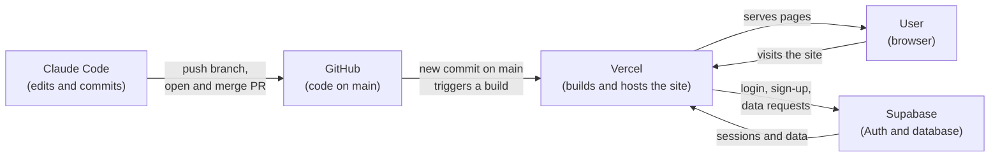

# Project Questions

## 1. Where does your code live?

On GitHub, in the repository [`zknox0260lpphilly/nextjs-with-supabase`](https://github.com/zknox0260lpphilly/nextjs-with-supabase). The `main` branch is the source of truth. It is a Next.js app (App Router, Tailwind CSS, shadcn/ui) that uses Supabase for login. Pages are in `app/`, shared components in `components/`, and the Supabase connection code in `lib/supabase/`.

## 2. Where does your data live, and what is stored there right now?

In a Supabase project (Postgres database plus Supabase Auth). The app finds it through two environment variables, `NEXT_PUBLIC_SUPABASE_URL` and `NEXT_PUBLIC_SUPABASE_PUBLISHABLE_KEY`, which are kept out of the repo (only `.env.example` is committed).

What the code stores right now:
- **User accounts.** Sign-up, login, logout and password reset all go through Supabase Auth, so emails and password hashes live in Supabase's auth users table.
- **No app tables yet.** The repo has no database migrations and the app code reads and writes no tables. The only table reference is a `notes` table in the optional tutorial component (`components/tutorial/fetch-data-steps.tsx`), which only exists if someone created it in Supabase.

I can't see inside the live Supabase project from the code, so the exact current contents (how many users, whether a `notes` table exists) need to be checked in the Supabase dashboard.

## 3. How does a change get from Claude Code to the live site? List the steps.

1. Claude Code edits the files on a working branch (for example `claude/nice-keller-k5sw98`).
2. It commits the change.
3. It pushes the branch to GitHub.
4. A pull request is opened from that branch into `main`.
5. The pull request is reviewed and merged into `main`.
6. Vercel, connected to the GitHub repo, sees the new commit on `main`, builds the app and publishes it to the live site. The Supabase environment variables are set in the Vercel project.

Steps 1 to 5 are what we did in this project. Step 6 assumes the repo is connected to a Vercel project. The repo has no `vercel.json` or `.vercel` folder, so confirm the connection in the Vercel dashboard.

## 4. What will you need to add to turn this into your team's app? Use your product manager's feature list.

_(To be filled in.)_

## 5. A diagram: boxes for the user, GitHub, Vercel and Supabase, with arrows showing what connects to what.

