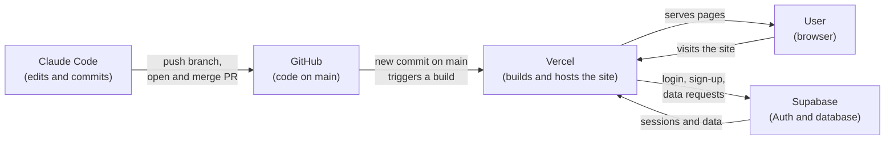

# Project Questions

## 1. Where does your code live?

On GitHub, in the repository [`zknox0260lpphilly/nextjs-with-supabase`](https://github.com/zknox0260lpphilly/nextjs-with-supabase). The `main` branch is the source of truth. It is a Next.js app (App Router, Tailwind CSS, shadcn/ui) that uses Supabase for login. Pages are in `app/`, shared components in `components/`, and the Supabase connection code in `lib/supabase/`.

## 2. Where does your data live, and what is stored there right now?

In a Supabase project (Postgres database plus Supabase Auth). The app finds it through two environment variables, `NEXT_PUBLIC_SUPABASE_URL` and `NEXT_PUBLIC_SUPABASE_PUBLISHABLE_KEY`, which are kept out of the repo (only `.env.example` is committed).

What the code stores right now:
- **User accounts.** Sign-up, login, logout and password reset all go through Supabase Auth, so emails and password hashes live in Supabase's auth users table.
- **No app tables yet.** The repo has no database migrations and the app code reads and writes no tables. The only table reference is a `notes` table in the optional tutorial component (`components/tutorial/fetch-data-steps.tsx`), which only exists if someone created it in Supabase.

I can't see inside the live Supabase project from the code, so the exact current contents (how many users, whether a `notes` table exists) need to be checked in the Supabase dashboard.

## 3. How does a change get from Claude Code to the live site? List the steps.

1. Claude Code edits the files on a working branch (for example `claude/nice-keller-k5sw98`).
2. It commits the change.
3. It pushes the branch to GitHub.
4. A pull request is opened from that branch into `main`.
5. The pull request is reviewed and merged into `main`.
6. Vercel, connected to the GitHub repo, sees the new commit on `main`, builds the app and publishes it to the live site. The Supabase environment variables are set in the Vercel project.

Steps 1 to 5 are what we did in this project. Step 6 assumes the repo is connected to a Vercel project. The repo has no `vercel.json` or `.vercel` folder, so confirm the connection in the Vercel dashboard.

## 4. What will you need to add to turn this into your team's app? Use your product manager's feature list.

**Ekip** is a support platform for the Haitian community. It connects people who need resources (a school that needs computers, a student who needs tutoring) with individuals, schools, organizations and volunteers who can help, and it helps turn a need into a real donation or action. The focus is education and technology. It is available in Haitian Creole, French, Spanish and English.

This repo is the Next.js + Supabase starter. It already gives us login, sign-up, password reset, a database connection and the blue/green theme. Everything below is what has to be added on top of it.

### Features to add

1. **Language picker (first screen).** Shows each language as a greeting ("Bonjou", "Bonjour", "Hola", "Hello") so people recognize their own. The whole interface switches as soon as one is chosen. All text is kept in translation files, one per language, instead of being written into the screens. A translation library such as `next-intl` would do this in Next.js. Native speakers should review the translations before launch.
2. **Location step (second screen).** Country first. If Haiti is chosen, also department (Ouest, Artibonite, Sud and so on) and then city or neighborhood. Location is stored as separate fields, not free text, so "posts near me" works.
3. **Remember the choices.** Language and location are saved so returning users skip straight to the home page. Both can be changed anytime from the top of the page. For signed-in users they are saved on their profile.
4. **Home page.** Explains what Ekip offers, with two clear paths ("I need help" and "I want to help"), the help categories (education, technology, school supplies, tutoring, scholarships, volunteering), sample posts near the user's city, and the three steps: post, connect, coordinate.
5. **Post a need or an offer.** A form for what is needed or offered, category, quantity, location and how to be contacted (in-app message, phone or WhatsApp). Posts have a status of open or fulfilled.
6. **Browse and search posts.** A list filtered by need or offer, category and location, with a detail page for each post.
7. **Contact and coordinate.** Messaging between the poster and the person who wants to help, so a donation can be arranged. A WhatsApp contact option, since many people already coordinate there.
8. **Accounts and profiles.** Keep the existing login and add a profile with language, location and who the user is (individual, school, organization or volunteer). The existing login screens need to be translated too.
9. **Low-bandwidth friendly.** Small images, cached posts that can be read offline, and a layout that works well on cheap Android phones, since connectivity in Haiti can be unreliable and data is expensive.
10. **Cleanup of the starter.** Rename the app to Ekip, and remove the starter's tutorial content, Vercel deploy button and demo links.

### Data to add in Supabase

- `profiles`: user, language, country, department, city, and type (individual, school, organization or volunteer).
- `posts`: need or offer, category, title, description, quantity, location fields, contact preference and status (open or fulfilled).
- `messages`: sender, recipient, the post it is about, text and time sent.
- Row-level security rules so people can only edit their own posts and read their own messages. Right now the project has no tables at all.

### Notes

- A Python/Flask prototype of the language, location and home flow was built in an earlier conversation. It is not part of this repo and does not need to be. The real app follows the same flow in Next.js so it can share the existing Supabase login and Vercel hosting.
- This feature list comes from the app description given in chat. If the product manager has a written list, compare it against this one and add anything missing.

## 5. A diagram: boxes for the user, GitHub, Vercel and Supabase, with arrows showing what connects to what.

